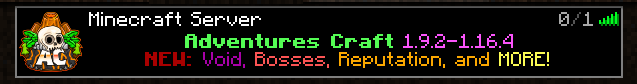
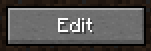
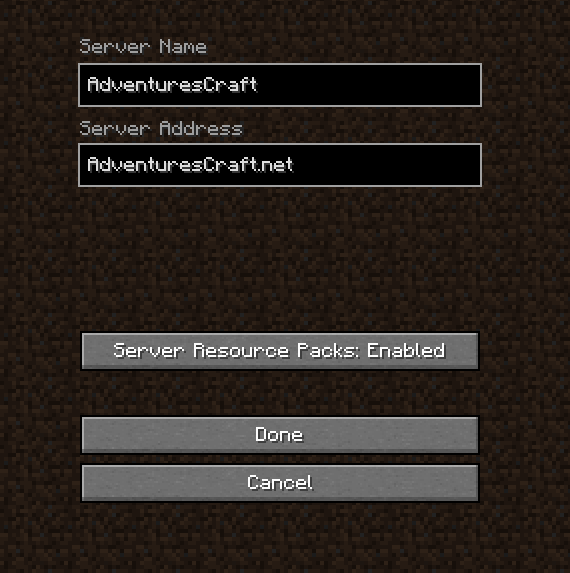

# **Resource Pack**

Our **Adventures Gamemode** has a custom Resource Pack avaiable for download. Of course using the Resource Pack offers new awesome and immesrive textures to improve your experience! 

## Getting the Resource Pack

1. Before joining **AdventuresCraft** click on the Server  

2. Click the **Edit** button near the bottom of the screen  

3. Change **Server Resource Packs:** until it says "**Enabled**"  

4. Join **AdventuresCraft.net**, and connect to the **Adventure Gamemode**
5. Upon logging in, the Resource Pack should begin downloading
6. If it does not begin, use **/RP Download** which will begin the download

